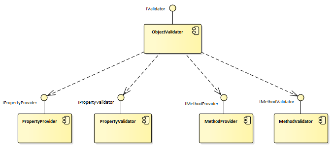
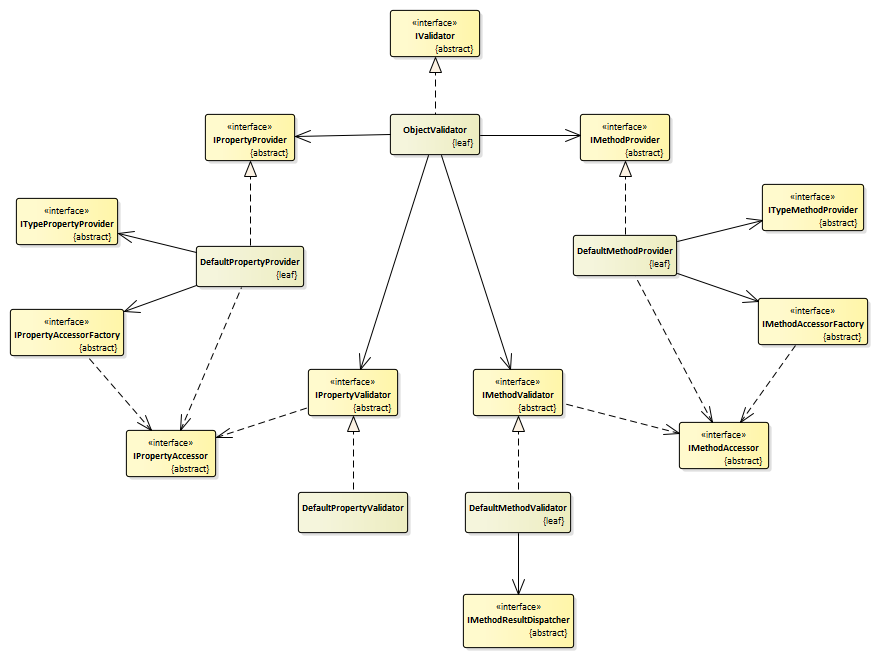
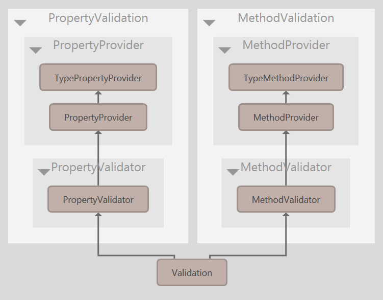

# System.ComponentModel.Annotations.Validation


### Overview

*System.ComponentModel.Annotations.Validation* is a extension of *System.ComponentModel* validation engine. Supports validation of properties and invariants for object graphs.

This library helps in writing validation logic in OOP and DDD-style, when the data and methods that check them are in one place.

Validation rules can be implemented in three ways:

- as attributes from [System.ComponentModel.Annotations](https://docs.microsoft.com/ru-ru/dotnet/api/system.componentmodel.dataannotations?view=netcore-2.2) or their heirs
- in the form of methods that represent class [invariants](https://github.com/dotnet/docs/blob/master/docs/standard/microservices-architecture/microservice-ddd-cqrs-patterns/domain-model-layer-validations.md)
- as the implementation of the [IValidatableObject](https://docs.microsoft.com/ru-ru/dotnet/api/system.componentmodel.dataannotations.ivalidatableobject?view=netcore-2.2) interface

The library is fully compatible with *System.ComponentModel.Annotations*, uses common base types.


### Features

- Validation of an individual object (properties and methods).
- Validation of the object graph, that is, several related links (including cyclical) objects.
- Asynchronous validation **TODO**.
- Reactive validation ([IObservable](https://docs.microsoft.com/ru-ru/dotnet/api/system.iobservable-1?view=netcore-2.2) interface implementation) **TODO**.
- Invariant methods can process validation logic in various ways: 
  - return single [ValidationResult](https://docs.microsoft.com/ru-ru/dotnet/api/system.componentmodel.dataannotations.validationresult?view=netcore-2.2), 
  - collection of `ValidationResult`, 
  - `true/false` (error flag), 
  - `string` (error message), 
  - may throw an [ValidationException](https://docs.microsoft.com/ru-ru/dotnet/api/system.componentmodel.dataannotations.validationexception?view=netcore-2.2) exception instead of the return value
  - or arbitrary `exception`.
- *Adapter for [FluentValidation](https://fluentvalidation.net/)* library **TODO**.


### Usage

Domain classes contain properties with validation attributes and invariant methods with more complex validation logic.

```c#
public class Engine
{
	[Required]
	[StringLength(15)]
	public string Name { get; set; }

	[Range(1, 24)]
	public int NumOfCylinders { get; set; }

	[Range(1000.0, 5000.0)]
	public double Cost { get; set; }

	[Invariant]
	private ValidationResult NameMustBeStartedWithCapitalize()
	{
		var firstSymbol = Model.First();
		if (!char.IsUpper(firstSymbol))
		{
			return new Fail($"'{firstSymbol}' is not uppercase.");
		}

		return Success();
	}

	[Invariant("The cost depends on the number of cylinders")]
        private IEnumerable<ValidationResult> CostDependsOnNumberOfCylinders()
	{
		if (NumOfCylinders == 4 && Cost < 1500)
		{
			yield return new Fail("4-cylinder engine cannot cost less than 1500!");
		}

		if (NumOfCylinders >= 12)
		{
			yield return new Fail("We do not serve tanks!");
		}
	}
}
```


Next, the validator checks the domain class instance.

```c#
var engine = new Engine();

IValidator validator = new ObjectValidator();

IEnumerable<ValidationResult> result = validator.Validate(engine);
```


### Architecture

The library architecture is a classic OOP.
The facade of the library, the *ObjectValidator* class, gets property accessors and method accessors (which contain class invariants) from the *PropertyProvider* and *MethodProvider* components, and then sends them to the *PropertyValidator* and *MethodValidator* components for checking.



The *DefaultPropertyProvider* class first uses *TypePropertyProvider* to get the property descriptors (*PropertyInfo*) of the class being validated, and then creates *PropertyAccessor* wrappers for them for quick access  using *PropertyAccessorFactory* . Next, the resulting *PropertyAccessors* are checked using the *PropertyValidator*.

Methods with invariants are handled similarly.



The "Show project dependency diagram" command of the *JetBrains ReSharper* tool generates the following diagram:




### Installation

Just install [System.ComponentModel.Annotations.Validation](Ссылка) from the package manager console:

```
PM> Install-Package ComponentModel.Annotations.Validation
```

If you need to use this library with [FluentValidation](https://github.com/JeremySkinner/FluentValidation) library, you will also need to install the appropriate package containing the adapter for *FluentValidation*:

```
PM> Install-Package ComponentModel.Annotations.Validation.FluentValidation
```


### Requirements

Depends to *System.ComponentModel.Annotations*. 


### Versioning

The project uses semantic versioning with [GitVersion](https://github.com/GitTools/GitVersion) utility.


#### Questions and Problems?

If you have significant questions, problems related to this library usage or if you want to discuss new features, please send email to a.karinskiy@hotmail.com.

If you've discovered a bug, please report it to the [GitHub Issues](https://github.com/andreykarinskiy/System.ComponentModel.Annotations.Validation/issues). Detailed reports with stack traces, actual and expected behaviors are welcome.


### Build

Use *Buid.cmd* in root package for build process or *Clean.cmd* if you need to delete all binary files before archiving or copying.

After building and testing, script Build.cmd creates a NuGet-package and publishes it to the local NuGet-repository on the developer's machine. The repository path is specified at the beginning of *Build.cmd* file in the `publishDir` constant.


### License

This project is licensed under the [MIT License](https://opensource.org/licenses/MIT).
